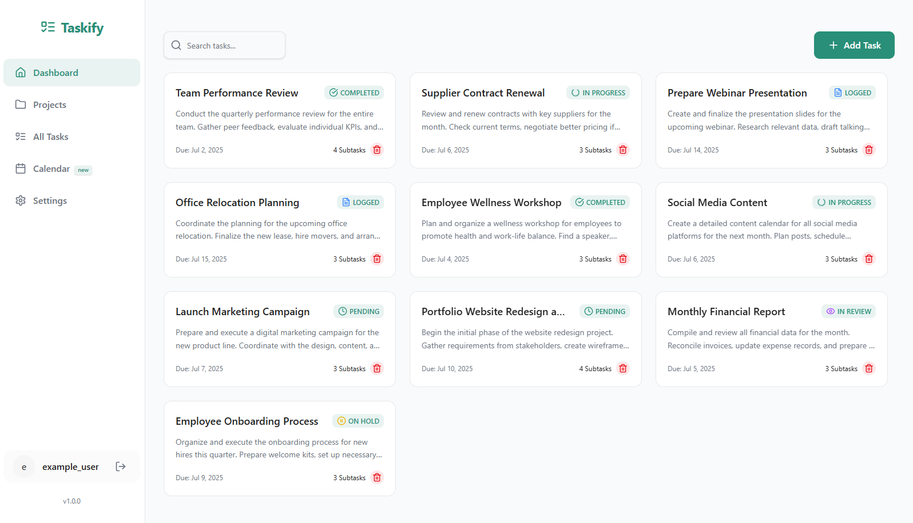
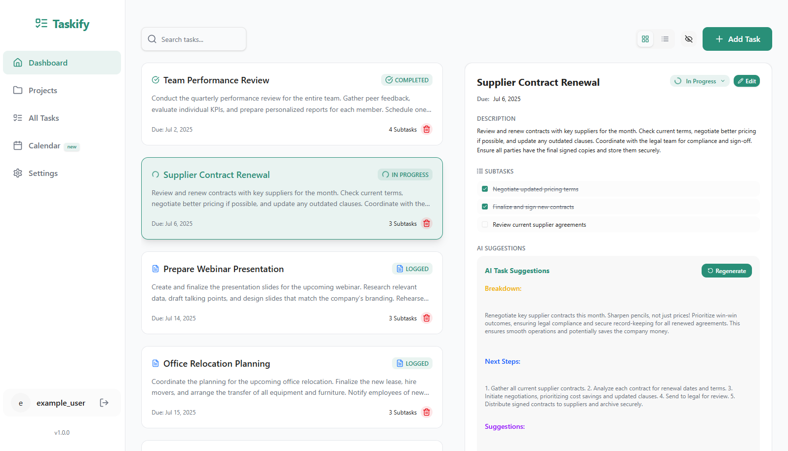

# Smart Task Manager with AI Assistance

## 📝 Project Overview

The **Smart Task Manager** lets users easily organize tasks with help from AI-powered subtask suggestions using **Google Gemini**. It features a clean **Next.js** frontend, a secure **Express** backend, and a **PostgreSQL** database hosted on **Supabase**. Users can create, edit, and manage tasks, while AI breaks work into clear subtasks. Secure API routes, responsive design, and smooth deployment make task management smart, simple, and reliable.


---

## 📂 Project Structure

- **Frontend:** Next.js (App Router) + Tailwind CSS + TypeScript  
- **Backend:** Express.js + Prisma ORM  
- **Database:** PostgreSQL (via Supabase)  
- **AI Integration:** Google Gemini API  
- **Deployment:** Firebase Hosting

---

## ✅ Key Features

- Create, update, and delete tasks
- Get **AI-generated subtask suggestions** with one click
- Store tasks and subtasks in a secure PostgreSQL database
- Fast and responsive UI with Tailwind CSS
- Environment-based API key management for secure AI requests

---

## 📸 Screenshots

  
*Task Manager Dashboard showing task list and AI suggestions.*

  
*Detailed task view with subtasks and editing options.*

---

## Challenges Faced

- Parsing Gemini’s AI response reliably and splitting it into clear, usable subtasks.
- Keeping the API key secure using environment variables and server API routes.
- Handling Gemini API errors gracefully to prevent the app from breaking.
- Keeping the UI simple, clean, and responsive while focusing on working core features.

---

## Setup Instructions

### 1️⃣ Clone this repository

```bash
git https://github.com/Siyammahdi/ai-task-management-taskify.git
cd ai-task-management-taskify
```

### 2️⃣ Install dependencies

```bash
pnpm install
```

_or_

```bash
npm install
```

### 4️⃣ Run the project locally

```bash
pnpm dev
```


Then open [http://localhost:3000](http://localhost:3000) in your browser.

---
